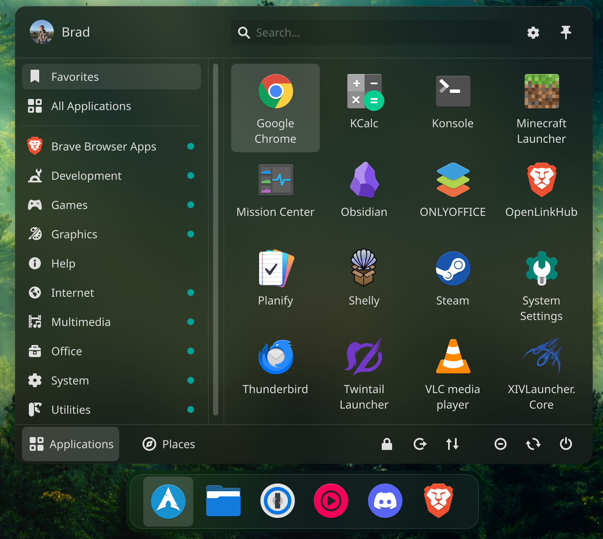

# Part 1
## Time
```
timedatectl set-local-rtc 1
```
## BTRFS Snapshots
```
sudo pacman -S --needed --noconfirm btrfs-assistant snapper snap-pac
```
- BTRFS Assistant
- Snapper Settings
- Number: 10
- Create a snapshot of the base install
## Hardware Acceleration Scripts
```
sudo wget -P ~/.config https://raw.githubusercontent.com/badams700/linux-setup/main/Files/chrome-flags.conf
sudo wget -P ~/Desktop https://raw.githubusercontent.com/badams700/linux-setup/main/Files/steam_dev.cfg
```
## QEMU VM
```
sudo pacman -S --needed --noconfirm qemu-full virt-manager swtpm
echo 'firewall_backend = "iptables"' | sudo tee -a /etc/libvirt/network.conf
sudo usermod -aG libvirt $USER
systemctl enable --now libvirtd.service
systemctl enable --now libvirtd.socket
sudo virsh net-autostart default
sudoufw route allow from 192.168.122.0/24
```
## Identify Windows EFI Path
```
lsblk
```
## Copy Windows Bootloader
```
sudo mkdir /mnt/WinBoot
sudo mount /dev/<DRIVE> /mnt/WinBoot
sudo cp -r /mnt/WinBoot/EFI/Microsoft /boot/EFI
sudo umount /mnt/WinBoot
sudo rm -r /mnt/WinBoot
```
## systemd-boot Config
/boot/loader/loader.conf
```
default @saved
timeout 1
console-mode max
```
## Configure mkinitcpio for UKI
/etc/mkinitcpio.d/linux-cachyos.preset
```
#default_image="/boot/initramfs-linux-cachyos.img"
default_uki="/boot/EFI/Linux/cachyos.efi"
```
## Edit Kernel Arguments
/etc/kernel/cmdline
```
acpi_enforce_resources=lax
```
## Generate UKI
```
sudo mkinitcpio -P
```
## Remove Kernel Image Folder and files in /boot
```
sudo rm /boot/initramfs-linux-cachyos.img /boot/initramfs-linux-cachyos-lts.img /boot/loader/entries/linux-cachyos.conf /boot/loader/entries/linux-cachyos-lts.conf
sudo su
cd /boot
ls
```
```
sudo rm -r <FOLDER>
```
## Secure Boot
```
sudo sbctl create-keys
sudo sbctl enroll-keys -m -f
sudo sbctl verify
```
Ensure all correct files are present
```
sudo sbctl-batch-sign
```
Reboot to UEFI and turn Secure Boot ON
```
systemctl reboot --firmware-setup
```

# Part 2
## Install Yay
```
cd ~/Projects
git clone https://aur.archlinux.org/yay.git
cd yay
makepkg -si
```
## Cider Repo
```
curl -s https://repo.cider.sh/ARCH-GPG-KEY | sudo pacman-key --add -
sudo pacman-key --lsign-key A0CD6B993438E22634450CDD2A236C3F42A61682
echo '[cidercollective]' | sudo tee -a /etc/pacman.conf
echo 'SigLevel = Required TrustedOnly' | sudo tee -a /etc/pacman.conf
echo 'Server = https://repo.cider.sh/arch' | sudo tee -a /etc/pacman.conf
```

## Install Software
```
sudo pacman -Syu --needed --noconfirm amdgpu_top blender calibre cava cdrdao cdrtools cider cmake deja-dup discord dvd+rw-tools dysk extra-cmake-modules ffmpeg flatpak gimp git go handbrake i2c-tools jre-openjdk k3b npm ntfs-3g ntfsprogs obs-studio-browser obsidian onlyoffice-bin openssh prismlauncher protonplus proton-pass proton-vpn-gtk-app rpi-imager terminus-font thunderbird transmission-gtk ttf-noto-nerd vlc
```
```
yay -S --needed --noconfirm google-chrome qdiskinfo twintaillauncher-bin visual-studio-code-bin xivlauncher zoom
```
```
flatpak install -y flathub io.github.maniacx.BudsLink io.github.wartybix.Constrict com.github.huluti.Curtail com.github.tchx84.Flatseal com.github.tenderowl.frog it.mijorus.gearlever org.jellyfin.JellyfinDesktop com.makemkv.MakeMKV io.github.alainm23.planify com.yubico.yubioath app.zen_browser.zen
```

## OpenLinkHub
```
cd ~/Projects
git clone https://github.com/jurkovic-nikola/OpenLinkHub.git
cd OpenLinkHub/
CGO_CFLAGS_ALLOW='-fno-strict-overflow' go build .
sudo chmod +x install.sh
sudo ./install.sh
```
```
sudo rm /opt/OpenLinkHub/config.json
sudo wget -P /opt/OpenLinkHub https://raw.githubusercontent.com/badams700/linux-setup/main/Files/config.json
```
```
echo 'KERNEL=="i2c-11", MODE="0600", OWNER="openlinkhub"' | sudo tee /etc/udev/rules.d/98-corsair-memory.rules
sudo udevadm control --reload-rules
sudo udevadm trigger
sudo systemctl restart OpenLinkHub.service
```

## Samba Share
```
sudo mkdir /mnt/Share /mnt/oppa
echo '//192.168.1.123/Share /mnt/Share cifs _netdev,nofail,uid=brad,username=badams,password=*password*,rw 0 0' | sudo tee -a /etc/fstab
```

## Fastfetch
```
mkdir ~/.config/fastfetch
wget -P ~/.config/fastfetch https://raw.githubusercontent.com/badams700/linux-setup/main/Files/config.jsonc
```

# DE-specific
## KDE
```
cd ~/Projects
git clone https://github.com/paulmcauley/klassy
cd klassy
git checkout plasma6.3
./install.sh
cd ~/Projects
sudo wget https://raw.githubusercontent.com/badams700/linux-setup/main/Files/WallpaperEngine_kde6-1.1e-1-x86_64.pkg.tar.zst
sudo pacman -U ./WallpaperEngine_kde6-1.1e-1-x86_64.pkg.tar.zst --overwrite '*'
cd ~/Projects
git clone https://github.com/badams700/Orchis-kde
cd Orchis-kde/
./install.sh
```
```
yay -S discover dolphin-plugins okular darkly kwin-effects-better-blur-dx
```
### KDE Discover
- Kurve
- Panel Colorizer
- Plasmusic Toolbar
- KDE Control Station
- Simple Separator
- Papirus Icons

## KDE Layout


## GNOME
```
commands here
```
