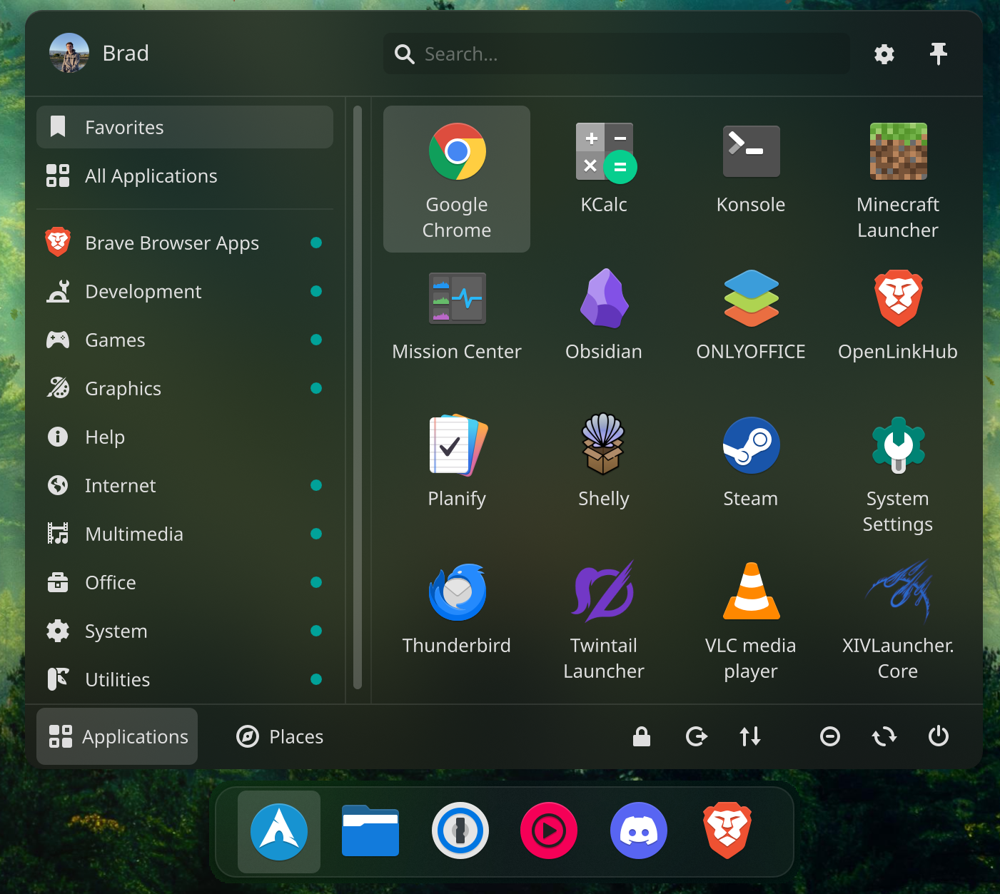

# Linux Setup

<details>
<summary> CachyOS </summary>
  
## Time Sync with Windows
```
timedatectl set-local-rtc 1
```
## Bootloader and Secure Boot
<details> 
<summary> UKI and Secure Boot </summary>

### Edit mkinitcpio Configuration
```
sudo nano /etc/mkinitcpio.d/linux-cachyos.preset
```
### Comment:
```
default_image="/boot/initramfs-linux-cachyos.img"
```
### Uncomment and Set Path:
```
default_uki="/boot/EFI/Linux/cachyos.efi"
```
### Edit Kernel Arguments
```
sudo nano /etc/kernel/cmdline
```
```
acpi_enforce_resources=lax
```
### Generate UKI
```
sudo mkinitcpio -P
```
### Add UEFI Boot Entry
```
sudo efibootmgr -c -d /dev/nvme<NUMBER> -p <PARTITION> -L CachyOS -l '\EFI\Linux\cachyos.efi'
```
### Remove Old Entries
```
sudo efibootmgr -b <ENTRY> -B
```
### Reboot to Ensure UKI Works
```
systemctl reboot
```
- ensure UKI shows up in UEFI boot menu
### Uninstall systemd-boot
```
sudo bootctl remove
```
### Remove from /boot:
- "loader" folder, any .img file, DO NOT remove **vmlinuz-linux** file.
### Reset UEFI to Setup Mode
```
systemctl reboot --firmware-setup
```
### Install and Configure sbctl
```
sudo pacman -S sbctl
sudo sbctl create-keys
sudo sbctl enroll-keys --microsoft --firmware-builtin
```
### Determine Binaries to Sign
```
sudo sbctl verify
```
### Sign UKI and vmlinuz
```
sudo sbctl sign -s /boot/EFI/Linux/cachyos.efi
sudo sbctl sign -s /boot/vmlinuz-linux
```
### Reboot to UEFI and Ensure Secure Boot is On
```
systemctl reboot --firmware-setup
```
### Verify
```
sudo bootctl
```
</details>

<details>
<summary> systemd-boot and Secure Boot </summary>

### Copy Windows Boot Manager to systemd-boot
```
sudo mkdir /mnt/WinBoot
sudo mount /dev/nvme<NUMBER> /mnt/WinBoot
sudo cp -r /mnt/WinBoot/EFI/Microsoft /boot/EFI
sudo umount /mnt/WinBoot
sudo rm -r /mnt/WinBoot
```
### Edit Kernel Arguments
```
sudo nano /etc/kernel/cmdline
```
```
acpi_enforce_resources=lax
```
### Reset UEFI to Setup Mode
```
systemctl reboot --firmware-setup
```
### Install and Configure sbctl
```
sudo pacman -S sbctl
sudo sbctl create-keys
sudo sbctl enroll-keys --microsoft --firmware-builtin
```
### Verify Binaries to Sign
```
sudo sbctl verify
```
### Batch Sign Binaries
```
sudo sbctl-batch-sign
```
### Reboot to UEFI and Ensure Secure Boot is On
```
systemctl reboot --firmware-setup
```
### Verify
```
sudo bootctl
```
</details>

<details>
<summary> Limine and Secure Boot <br/></summary>

### Edit Limine config file
```
sudo nano /boot/limine.conf
```
### Edit the following lines:
```
term_background: 00000000
- remove wallpaper line
```
### Reset UEFI to Setup Mode
```
systemctl reboot --firmware-setup
```
### Install and configure sbctl
```
sudo pacman -S sbctl
sudo sbctl create-keys
sudo sbctl enroll-keys --microsoft --firmware-builtin
```
### Configure Limine
```
sudo nano /etc/default/limine
```
### Add the following line and kernel argument:
```
ENABLE_ENROLL_LIMINE_CONFIG=yes
acpi_enforce_resources=lax
```
### Sign Limine
```
sudo limine-enroll-config
sudo limine-update
```
### Reboot to UEFI and Ensure Secure Boot is On
```
systemctl reboot --firmware-setup
```
### Verify
```
sudo bootctl
```
</details>

## AUR Helper
### Remove paru
```
sudo pacman -Rs paru
```
### Install yay
```
cd Projects/
git clone https://aur.archlinux.org/yay.git
cd yay
makepkg -si
```
## Signing Keys and Repos
### Import Cider Signing Key
```
curl -s https://repo.cider.sh/ARCH-GPG-KEY | sudo pacman-key --add -
sudo pacman-key --lsign-key A0CD6B993438E22634450CDD2A236C3F42A61682
```
### Add Cider Repo
```
sudo nano /etc/pacman.conf
```
```
[cidercollective]
SigLevel = Required TrustedOnly
Server = https://repo.cider.sh/arch
```
### Refresh pacman
```
sudo pacman -Syu
```
## Bulk Install Programs
### Pacman
```
sudo pacman -S flatpak

sudo pacman -S obs-studio browser

sudo pacman -S amdgpu_top bazaar blender btrfs-assistant btrfsmaintenance calf cava cider cmake deja-dup discord dolphin-plugins easyeffects extra-cmake-modules ffmpeg gimp git go handbrake jre-openjdk lsp-plugins-lv2 mda.lv2 mission-center npm obsidian okular onlyoffice-bin openssh protonplus proton-pass proton-vpn-gtk-app rpi-imager snapper terminus-font thunderbird transmission-gtk vlc zam-plugins
```
### AUR
```
yay -S darkly google-chrome kwin-effects-better-blur-dx minecraft-launcher plasma6-applets-kurve plasma6-applets-panel-colorizer plasma6-applets-plasmusic-toolbar qdiskinfo twintaillauncher-bin visual-studio-code-bin xivlauncher zoom
```
### Calibre
```
sudo -v && wget -nv -O- https://download.calibre-ebook.com/linux-installer.sh | sudo sh /dev/stdin
```
### Proton Mail Bridge
```
cd Projects/

mkdir protonmail

cd protonmail

wget https://raw.githubusercontent.com/badams700/linux-setup/main/PKGBUILD

makepkg -si
```
### Flatpak
```
BudsLink, Constrict, Flatseal, Frog, Gear Lever, Jellyfin Desktop, Laser, MakeMKV, Planify, Yubico Authenticator
```
### Easy Effects Presets
```
bash -c "$(curl -fsSL https://raw.githubusercontent.com/JackHack96/EasyEffects-Presets/master/install.sh)"
```
## Console Font
```
sudo nano /etc/vconsole.conf
FONT=ter-132b
```
## OpenLinkHub - Corsair
### Build + Install
```
cd Projects/

git clone https://github.com/jurkovic-nikola/OpenLinkHub.git

cd OpenLinkHub/

CGO_CFLAGS_ALLOW='-fno-strict-overflow' go build .

chmod +x install.sh

sudo ./install.sh
```
### Configure RAM
```
sudo i2cdetect -l
```
### Find SMBUS controller
```
sudo dmidecode -t memory | grep 'Part Number'
```
### Add Memory Info
```
sudo nano /opt/OpenLinkHub/config.json
```
### Udev Rules
```
echo 'KERNEL=="i2c-11", MODE="0600", OWNER="openlinkhub"' | sudo tee /etc/udev/rules.d/98-corsair-memory.rules
sudo udevadm control --reload-rules
sudo udevadm trigger
```
### Restart Service
```
sudo systemctl restart OpenLinkHub.service
```
## Automount Network Share
```
sudo mkdir /mnt/Share

sudo nano /etc/fstab
```
### Add to fstab:
```
//192.168.1.123/Share /mnt/Share cifs _netdev,nofail,uid=brad,username=badams,password=<password>,rw 0 0
```
## Klassy
```
cd Projects/

git clone https://github.com/paulmcauley/klassy

cd klassy

git checkout plasma6.3

./install.sh
```
## KDE Wallpaper Engine
### Install Wallpaper Engine via Steam - use Windows 7 compatibility mode 
```
cd Projects/

sudo wget https://github.com/slynobody/SteamOS-wallpaper-engine-kde-plugin/releases/download/0.55d_arch/WallpaperEngine_kde6-1.1e-1-x86_64.pkg.tar.zst

sudo pacman -U ./WallpaperEngine_kde6-1.1e-1-x86_64.pkg.tar.zst --overwrite '*'
```
## Orchis
```
cd Projects/

git clone https://github.com/vinceliuice/Orchis-kde

cd Orchis-kde/

./install.sh
```
## Fastfetch
```
mkdir ~/.config/fastfetch

cd ~/.config/fastfetch

wget https://raw.githubusercontent.com/badams700/linux-setup/main/config.jsonc
```
## KDE Layout

### KDE Store
- KDE Control Station
- Papirus Icons

## KDE Blur
### Download
```
cd Projects/

wget https://raw.githubusercontent.com/badams700/linux-setup/main/blur.kwinrule
```
- Import via Settings
## Game Locations
### FFXIV
```
~/.xlcore/
```
### TwinTail
```
~/.local/share/twintaillauncher/games/
```
</details>

---

<details>
<summary> Fedora </summary>

## RPM Fusion
```
sudo dnf install -y https://mirrors.rpmfusion.org/free/fedora/rpmfusion-free-release-$(rpm -E %fedora).noarch.rpm

sudo dnf install -y https://mirrors.rpmfusion.org/nonfree/fedora/rpmfusion-nonfree-release-$(rpm -E %fedora).noarch.rpm

sudo dnf install rpmfusion-free-appstream-data rpmfusion-nonfree-appstream-data

sudo dnf check-update
```

## Flatpak
```
flatpak remote-delete fedora

flatpak remote-add --if-not-exists flathub https://flathub.org/repo/flathub.flatpakrepo
```

## Laptop Graphics
```
sudo dnf install -y libva-intel-driver
```

## Media Codecs
```
sudo dnf swap ffmpeg-free ffmpeg --allowerasing

sudo dnf update @multimedia --setopt="install_weak_deps=False" --exclude=PackageKit-gstreamer-plugin

sudo dnf groupupdate sound-and-video
```

## Hardware Acceleration
```
sudo dnf install -y ffmpeg-libs libva libva-utils
```

## Firefox Video
```
sudo dnf install -y openh264 gstreamer1-plugin-openh264 mozilla-openh264

sudo dnf config-manager --set-enabled fedora-cisco-openh264

sudo dnf update -y
```

## Archives
```
sudo dnf install -y p7zip p7zip-plugins unrar 
```
## AppImages
```
sudo dnf install -y fuse fuse-libs

flatpak install flathub it.mijorus.gearlever
```
## VSCode
```
sudo rpm --import https://packages.microsoft.com/keys/microsoft.asc

sudo sh -c 'echo -e "[code]\nname=Visual Studio Code\nbaseurl=https://packages.microsoft.com/yumrepos/vscode\nenabled=1\ngpgcheck=1\ngpgkey=https://packages.microsoft.com/keys/microsoft.asc" > /etc/yum.repos.d/vscode.repo'

sudo dnf install code
```

## Multimedia
```
sudo dnf install -y vlc

flatpak install -y flathub com.obsproject.Studio
```

## Productivity
```
flatpak install -y flathub org.onlyoffice.desktopeditors
```

## Utilities
```
flatpak install flathub io.missioncenter.MissionCenter
```

## Cleanup
```
sudo dnf clean all

sudo dnf autoremove -y
```

## GRUB Settings
```
sudo nano /etc/default/grub
```
```
GRUB_TIMEOUT=0
GRUB_TIMEOUT_STYLE=hidden
GRUB_HIDDEN_TIMEOUT_QUIET=true
```
```
sudo grub2-mkconfig -o /boot/grub2/grub.cfg
```

## Secure Boot and NVIDIA Drivers
```
mokutil --sb-state

sudo dnf update
```
*install RPMFusion repos, if not installed, then continue*
```
sudo dnf install kmodtool akmods mokutil openssl

sudo kmogenca -a

sudo mokutil --import /etc/pki/akmods/certs/public_key.der

systemctl reboot

sudo dnf install akmod-nvidia

sudo dnf install xorg-x11-drv-nvidia-cuda

modinfo -F version nvidia

systemctl reboot

nvidia-smi
```

## GDM HiDPI
```
sudo cp -f ~/.config/monitors.xml ~gdm/.config/monitors.xml

sudo chown $(id -u gdm):$(id -g gdm) ~gdm/.config/monitors.xml

sudo restorecon ~gdm/.config/monitors.xml
```

## Useful GNOME Extensions
Dash to Dock

Blur My Shell

KDE Connect

Control Monitor Brightness by DCC

In Picture

Just Perfection

AppIndicator and KStatus
</details>

---

<details>
<summary> Homelab Server </summary>
  
## Docker Containers ##
```
Arcane - Docker Management
Immich - Photos
Jellyfin - Movies
NGINX Proxy Manager - Reverse Proxy
Sui - Homepage
UpSnap - Wake on LAN
```

## System Services ##
```
Samba
Homebridge
```

## Cockpit Reverse Proxy ##
Edit /etc/cockpit/cockpit.conf
```
[WebService]
Origins = https://cockpit.brdams.com wss://cockpit.brdams.com
ProtocolHeader = X-Forwarded-Proto
```
Set Cockpit in NGINX to https
</details>

---
